# Tank Survivors

Top-down tank arena survival in the Vampire Survivors vein: last as long as you can against escalating swarms, then spend typed scrap between runs on a branching cannon tree.

Unlike classic auto-shooters, you aim the turret yourself. The tank stays centered on screen while the world scrolls. There’s no win screen—runs end when you’re wrecked. Kills drop **Circuit**, **Plating**, and **Core** shards; milestones unlock deeper weapon options.

## Play

```bash
npm start
```

Open `http://localhost:4200`.

- **WASD** move, **mouse** aim turret, **hold click** to fire
- Level up in-run for stats; unlock weapon-tree nodes between runs with Circuit / Plating / Core

## Screens

**Home** — Title and pitch. Start a run, or open the Hangar first.

**Hangar** — Between-run hub. Scrap banks, weapon tree, **map select** (Open Yard / Ruined Depot / Tight Foundry), best times, Deploy.

**Run** — Full-screen arena with HUD (map name, HP, level, timer, kills, scrap C/P/K, XP). Overlays pause the action for:

- **Level up** — pick 1 of 3 upgrades
- **Wrecked!** — run summary (map, time, kills, level, scrap by type) → Hangar, Retry, or Home

No pause menu or settings screen yet.

## Maps

Three authored arenas (walls + size). Pick in the Hangar; Home Start Run uses your last selection.

| Map                     | Layout                | Enemies                           |
| ----------------------- | --------------------- | --------------------------------- |
| **Open Yard** (starter) | Large open circle     | Swarm / chaser heavy              |
| **Ruined Depot**        | Medium + cover walls  | Brutes + spitters                 |
| **Tight Foundry**       | Smaller + dense walls | Exploder pressure, higher density |

Unlock the next map by lasting **20:00** on the previous one. Walls block movement and all projectiles. Weapon milestones (`survive_5` / `survive_10`) are global across maps.

## A run

You enter with whatever cannon path you equipped in the Hangar (default: Main Cannon).

- Move with WASD; the hull faces how you move
- Aim the turret with the mouse; hold click to fire
- Enemies densify over time: scout drones and swarm bots first, then brutes, ranged spitters, and suicidal exploders
- Kills grant XP automatically and drop colored scrap shards (Circuit / Plating / Core by enemy role); pick shards up to bank them for the Hangar
- Bosses at **5:00** and **10:00** are milestones, not a finale
- When HP hits zero → banked scrap deposits to meta → back to Hangar

In-run upgrades are stats only. Weapon identity is what you chose before the run.

## Scrap economy

Three currencies, one per cannon branch at L2/L3:

| Currency            | Branch |
| ------------------- | ------ |
| **Circuit** (cyan)  | Rapid  |
| **Plating** (steel) | Spread |
| **Core** (amber)    | Heavy  |

L4 leaves cost a **primary-heavy mix** (lots of the branch type + some of the other two). Enemy drops lean by role (swarm → Circuit-led, brute → Plating+Core, bosses → big mixes). There is no end-of-run time/kill scrap formula — only shards you pick up.

## The Hangar

Typed scrap funds a single starter cannon tree. You can unlock siblings over time, but each run you equip **one contiguous path** from the Main Cannon root down to a leaf. Other unlocks stay owned; they just aren’t active until you re-equip that branch.

Branches feel different: minigun / beam / pierce vs pulse waves / omni burst / spread vs heavy slugs / armor piercer / HE splash. Deeper nodes need both the right scrap mix and survival milestones (notably lasting 5 and 10 minutes).

### Weapon tree

Equip one root → leaf path. All **L3** nodes need **survive 5:00**; all **L4** leaves need **survive 10:00**.

```text
Main Cannon
├── Rapid Fire
│   ├── Minigun                  [5:00]
│   │   ├── Hailstorm            [10:00]
│   │   ├── Twin Barrels         [10:00]
│   │   └── Overheat             [10:00]
│   ├── Beam Lance               [5:00]
│   │   ├── Long Beam            [10:00]
│   │   ├── Wide Beam            [10:00]
│   │   └── Split Beam           [10:00]
│   └── Piercing Rounds          [5:00]
│       ├── Skewer               [10:00]
│       ├── Drill Bit            [10:00]
│       └── Ricochet Round       [10:00]
├── Spread Shot
│   ├── Pulse Wave               [5:00]
│   │   ├── Tidal Pulse          [10:00]
│   │   ├── Residue Trail        [10:00]
│   │   └── Breaker              [10:00]
│   ├── Omni Burst               [5:00]
│   │   ├── Orbit Burst          [10:00]
│   │   ├── Rotary Spray         [10:00]
│   │   └── Nova Shell           [10:00]
│   └── Wide Spread              [5:00]
│       ├── Helix Spread         [10:00]
│       ├── Homing Rounds        [10:00]
│       └── Shot Wall            [10:00]
└── Heavy Shells
    ├── Slugger                  [5:00]
    │   ├── Siege Slug           [10:00]
    │   ├── Wrecking Ball        [10:00]
    │   └── Tar Shell            [10:00]
    ├── Armor Piercer            [5:00]
    │   ├── Boss Breaker         [10:00]
    │   ├── Armor Cracker        [10:00]
    │   └── Point Blank          [10:00]
    └── HE Shell                 [5:00]
        ├── Cluster Charge       [10:00]
        ├── Shockwave            [10:00]
        └── Delayed Charge       [10:00]
```



```mermaid
flowchart TB
  root[Main Cannon]
  rapid[Rapid Fire]
  spread[Spread Shot]
  heavy[Heavy Shells]

  root --> rapid
  root --> spread
  root --> heavy

  super[Minigun]
  laser[Beam Lance]
  needle[Piercing Rounds]
  rapid --> super & laser & needle
  super --> hail[Hailstorm] & twin[Twin Barrels] & overheat[Overheat]
  laser --> long[Long Beam] & wideBeam[Wide Beam] & split[Split Beam]
  needle --> skewer[Skewer] & drill[Drill Bit] & ricochet[Ricochet Round]

  wave[Pulse Wave]
  spin[Omni Burst]
  wide[Wide Spread]
  spread --> wave & spin & wide
  wave --> tidal[Tidal Pulse] & residue[Residue Trail] & breaker[Breaker]
  spin --> orbit[Orbit Burst] & rotary[Rotary Spray] & nova[Nova Shell]
  wide --> helix[Helix Spread] & homing[Homing Rounds] & wall[Shot Wall]

  slugger[Slugger]
  crush[Armor Piercer]
  he[HE Shell]
  heavy --> slugger & crush & he
  slugger --> siege[Siege Slug] & wreck[Wrecking Ball] & tar[Tar Shell]
  crush --> boss[Boss Breaker] & armor[Armor Cracker] & point[Point Blank]
  he --> cluster[Cluster Charge] & shock[Shockwave] & delayed[Delayed Charge]
```

## How it fits together

```text
Home → Hangar (scrap, weapon, map) → Deploy
         ↑                                      │
         └── Wrecked! (scrap + map best + milestones) ←────┘
                    Survive waves + bosses,
                    level stats mid-run
```

Identity lives in the Hangar; improvisation lives in the arena. The tree says _how_ you shoot this run; level-ups say how hard you push that identity before you wreck.

## Future plans

V1 is a tight desktop loop. Deferred ideas:

- Extra weapons and **gadgets** (mines, drones, auras)—not just one deep cannon path
- Real terrain / authored maps beyond the three wall+size arenas
- Hazards and map-specific scrap tables
- Objectives beyond “survive as long as you can”
- Mobile / touch controls
- Polished sprites instead of procedural vector art
- Sound polish, multiplayer, cloud/account saves
- Possibly a third boss beat around 15 minutes (V1 has 5 and 10)

Boss-defeat gates are labeled in the Hangar as scaffolding; deeper tree nodes mostly gate on survival time for now.

## Stack

- Angular 19 (routing, hangar UI, HUD, `localStorage` meta save)
- PixiJS 8 (arena simulation + procedural vector art)
